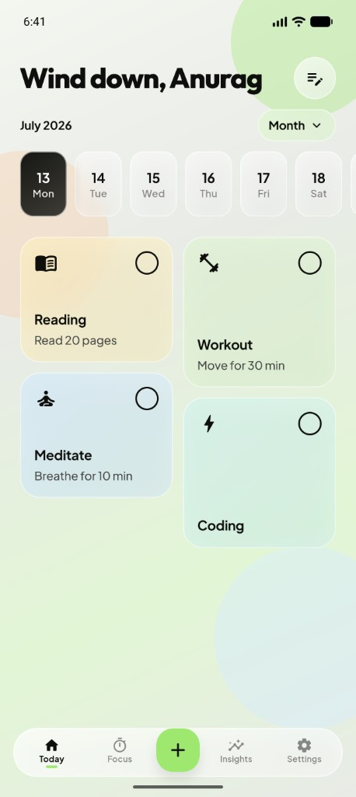
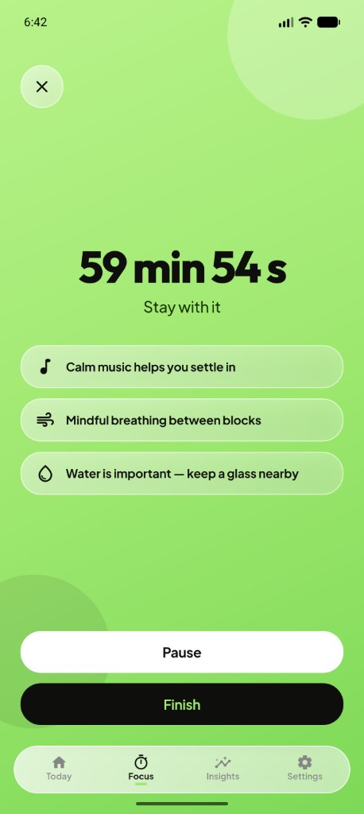
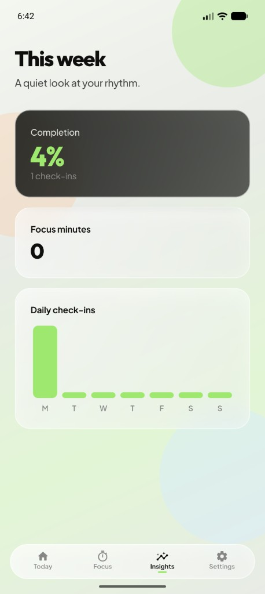

# Pulse

A calm habit tracker and focus timer for small daily rituals.

Build habits you can finish. Protect your attention. See your week without the noise.  
Everything stays on your phone — no account required.

  
  &nbsp;
  
  &nbsp;
  

---

### Today  
Colorful habits, streaks, and a greeting that meets you where you are.

### Focus  
Pomodoro or free sessions. Pause when you need to. On iPhone, your timer stays with you on the Lock Screen and Dynamic Island — each session with its own quiet quote.

### Insights  
A soft look at your week — completion, check-ins, and focus time. Enough to notice your rhythm, not overwhelm it.

### Always nearby  
A home screen widget for today’s habits and focus minutes.

### Private by design  
Your data lives on your device. No sign-in. No cloud. Back up or restore anytime from Settings.

---

Available on **iPhone** and **Android**.
